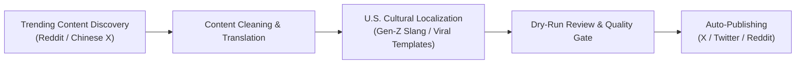

# Viral Meme Curator Skill

This skill enables Antigravity to scrape hot viral memes and posts from Reddit and Chinese X (Twitter), adapt and rewrite them into authentic American internet humor (Gen-Z slang, Zoomer meme templates, U.S. pop culture banter), and automatically publish them.

---

## Capabilities & Workflow



---

## Step 1: Content Discovery & Scraping

Execute the content discovery scripts to fetch trending topics:

1. **Fetch Reddit Hot Memes**:
   ```bash
   python scripts/fetch_reddit_trending.py --subreddit memes --limit 10 --timeframe day
   ```
   *Available subreddits*: `memes`, `dankmemes`, `wallstreetbets`, `AskReddit`, `technology`, `funny`.

2. **Fetch Chinese X (Twitter) Hot Posts**:
   ```bash
   python scripts/fetch_chinese_x_trending.py --query "推特热搜 OR 梗" --limit 10
   ```

---

## Step 2: U.S. Meme Localization & Adaptation

Refer to the reference guides for slang and formatting:
* [U.S. Internet Slang Dictionary](./references/us_slang_dictionary.md)
* [Viral Tweet Templates](./references/viral_tweet_templates.md)

Run the rewriter script to transform draft posts:
```bash
python scripts/meme_rewriter.py --input-file temp/scraped_content.json --style genz_zoomer
```

### Rewriting Rules:
1. **Cultural Adaptation**: Replace Chinese local metaphors or niche Reddit references with U.S. equivalents (e.g. Super Bowl, NBA, Chipotle, CostCo, WallStreetBets, NFL, Crypto/Tech culture).
2. **Humor Style**: Use authentic American Zoomer/Gen-Z slang (`no cap`, `let him cook`, `crash out`, `glaze`, `fr fr`, `main character energy`, `brainrot`, `skibidi`).
3. **Format**: Apply viral X/Twitter formats (`POV:`, `Bro really thought...`, `My honest reaction:`, `Nobody:`).

---

## Step 3: Dry-Run & Publishing

1. **Dry-Run Preview**:
   ```bash
   python scripts/auto_publisher.py --dry-run
   ```
2. **Publish to X (Twitter)**:
   ```bash
   python scripts/auto_publisher.py --platform twitter --post-id <ID>
   ```

---

## Configuration

Ensure API keys are set in `config.json` or `.env`:
* `REDDIT_CLIENT_ID`, `REDDIT_CLIENT_SECRET`
* `TWITTER_API_KEY`, `TWITTER_API_SECRET`, `TWITTER_ACCESS_TOKEN`, `TWITTER_ACCESS_TOKEN_SECRET`
* `OPENAI_API_KEY` or LLM API endpoint for meme adaptation.
